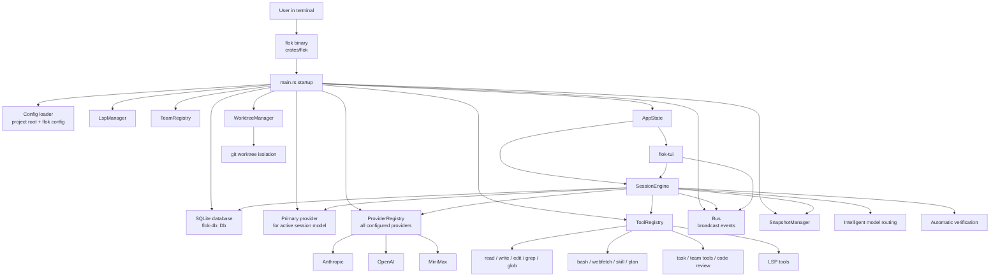

# Flok System Architecture

This diagram shows how the main crates and runtime subsystems fit together in
the current implementation.

```mermaid
flowchart TD
    User[User in terminal] --> CLI[flok binary<br/>crates/flok]
    CLI --> Main[main.rs startup]

    Main --> Config[Config loader<br/>project root + flok config]
    Main --> DB[SQLite database<br/>flok-db::Db]
    Main --> Provider[Primary provider<br/>for active session model]
    Main --> Registry[ProviderRegistry<br/>all configured providers]
    Main --> Tools[ToolRegistry]
    Main --> Bus[Bus<br/>broadcast events]
    Main --> Snapshot[SnapshotManager]
    Main --> LSP[LspManager]
    Main --> Teams[TeamRegistry]
    Main --> Worktree[WorktreeManager]
    Main --> State[AppState]

    Tools --> ReadWrite[read / write / edit / grep / glob]
    Tools --> ExecTools[bash / webfetch / skill / plan]
    Tools --> AgentTools[task / team tools / code review]
    Tools --> LspTools[LSP tools]

    State --> Engine[SessionEngine]
    State --> TUI[flok-tui]

    Engine --> Provider
    Engine --> Registry
    Engine --> Tools
    Engine --> DB
    Engine --> Snapshot
    Engine --> Bus

    TUI --> Bus
    TUI --> Engine

    Registry --> Anthropic[Anthropic]
    Registry --> OpenAI[OpenAI]
    Registry --> MiniMax[MiniMax]

    Engine --> Routing[Intelligent model routing]
    Engine --> Verify[Automatic verification]

    Worktree --> Git[git worktree isolation]
```
