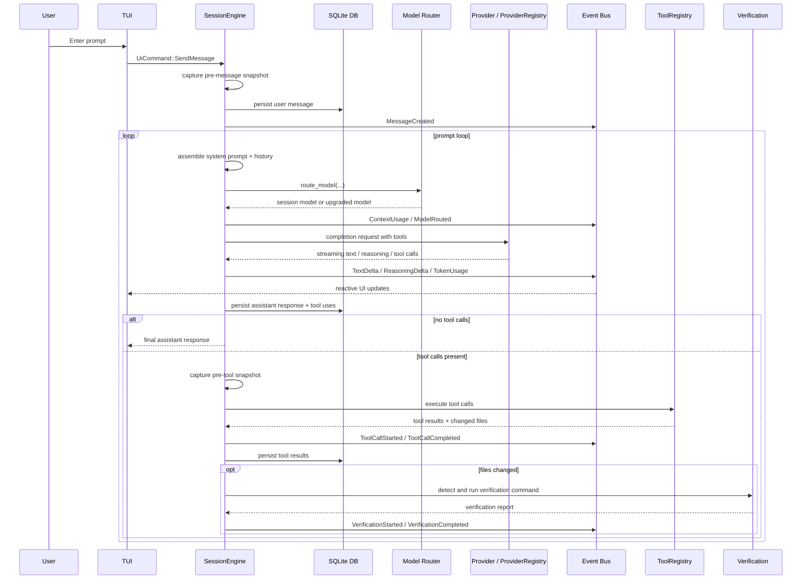

# Flok Interactive Session Flow

This diagram shows what happens when a user sends a message in interactive mode.

```mermaid
sequenceDiagram
    participant U as User
    participant T as TUI
    participant E as SessionEngine
    participant D as SQLite DB
    participant R as Model Router
    participant P as Provider / ProviderRegistry
    participant B as Event Bus
    participant X as ToolRegistry
    participant V as Verification

    U->>T: Enter prompt
    T->>E: UiCommand::SendMessage

    E->>E: capture pre-message snapshot
    E->>D: persist user message
    E->>B: MessageCreated

    loop prompt loop
        E->>E: assemble system prompt + history
        E->>R: route_model(...)
        R-->>E: session model or upgraded model
        E->>B: ContextUsage / ModelRouted

        E->>P: completion request with tools
        P-->>E: streaming text / reasoning / tool calls
        E->>B: TextDelta / ReasoningDelta / TokenUsage
        B-->>T: reactive UI updates

        E->>D: persist assistant response + tool uses

        alt no tool calls
            E-->>T: final assistant response
        else tool calls present
            E->>E: capture pre-tool snapshot
            E->>X: execute tool calls
            X-->>E: tool results + changed files
            E->>B: ToolCallStarted / ToolCallCompleted
            E->>D: persist tool results

            opt files changed
                E->>V: detect and run verification command
                V-->>E: verification report
                E->>B: VerificationStarted / VerificationCompleted
            end
        end
    end
```
