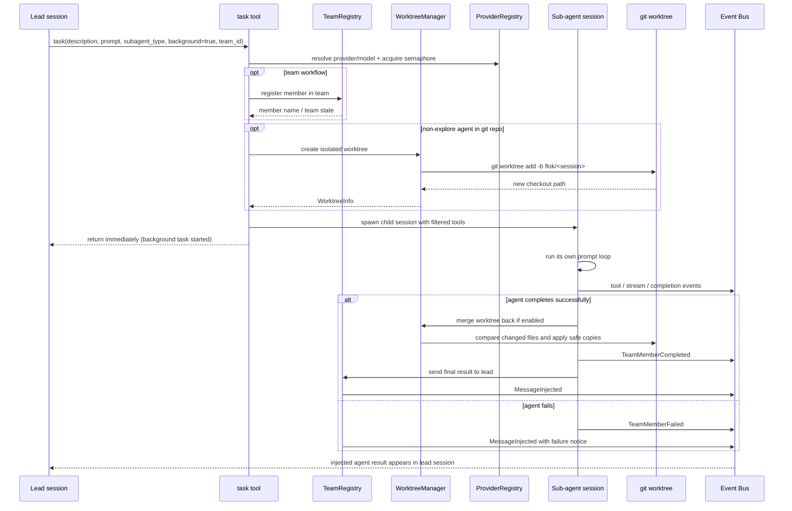

# Flok Sub-Agents, Teams, and Worktrees

This diagram shows the main background-agent path driven by the `task` tool.

```mermaid
sequenceDiagram
    participant Lead as Lead session
    participant Task as task tool
    participant Team as TeamRegistry
    participant WT as WorktreeManager
    participant PR as ProviderRegistry
    participant Agent as Sub-agent session
    participant Git as git worktree
    participant Bus as Event Bus

    Lead->>Task: task(description, prompt, subagent_type, background=true, team_id)
    Task->>PR: resolve provider/model + acquire semaphore

    opt team workflow
        Task->>Team: register member in team
        Team-->>Task: member name / team state
    end

    opt non-explore agent in git repo
        Task->>WT: create isolated worktree
        WT->>Git: git worktree add -b flok/<session>
        Git-->>WT: new checkout path
        WT-->>Task: WorktreeInfo
    end

    Task->>Agent: spawn child session with filtered tools
    Task-->>Lead: return immediately (background task started)

    Agent->>Agent: run its own prompt loop
    Agent->>Bus: tool / stream / completion events

    alt agent completes successfully
        Agent->>WT: merge worktree back if enabled
        WT->>Git: compare changed files and apply safe copies
        Agent->>Bus: TeamMemberCompleted
        Agent->>Team: send final result to lead
        Team->>Bus: MessageInjected
    else agent fails
        Agent->>Bus: TeamMemberFailed
        Team->>Bus: MessageInjected with failure notice
    end

    Bus-->>Lead: injected agent result appears in lead session
```
